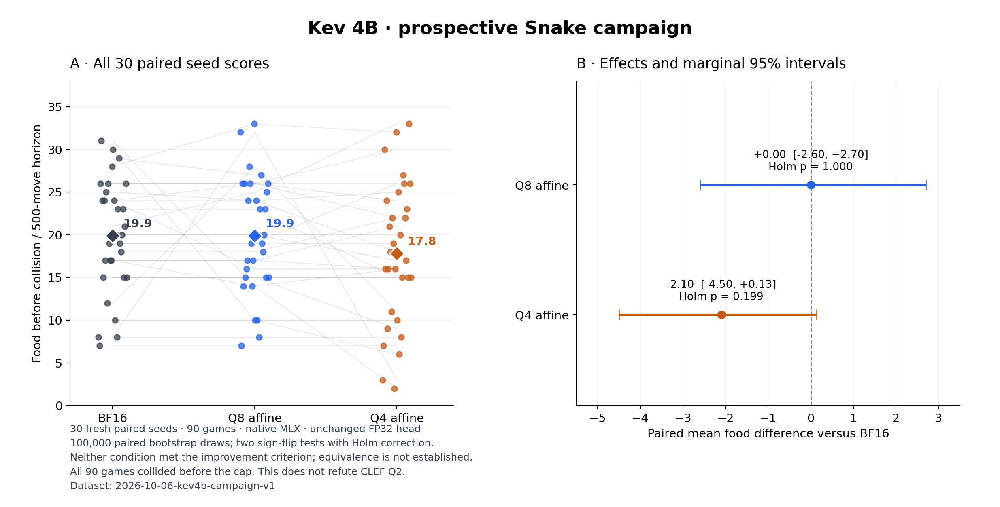

# Less Precision, Better Decisions?

*An exploratory study of CLEF-Flash backbone quantization on Snake.*

In **15 paired random environment seeds**, IQ2_M collected **18.53 food on average**, versus **12.20 for the official BF16 configuration**: an observed **+51.9%**, with **11 wins, 2 ties and 2 losses**. Q6_K_L and Q4_K_M stayed much closer to BF16. The completed Q2_K extension averaged **17.13 food (+40.4% versus BF16)**. This is a task-specific observation, **not a monotonic relationship or proof that quantization improves reasoning**.

**New prospective Kev result:** 90 games on 30 fresh paired seeds, with a common native MLX runtime and fixed FP32 head. BF16 and Q8 averaged 19.9 food; Q4 averaged 17.8. Neither quantization met the frozen improvement criterion. This does not establish equivalence or refute CLEF Q2. [Audited results, data and figures](docs/KEV_CAMPAIGN_RESULTS.md).


[Additional cap-marked and portrait figures, captions and provenance](analysis/2026-10-05-fiveway/FIGURES.md)

## CLEF discovery snapshot

| Backbone configuration | Mean food | Median | Range | Collisions / capped alive |
|---|---:|---:|---|---|
| Official BF16 | 12.20 | 13 | 1–29 | 15 / 0 |
| Q6_K_L | 12.33 | 12 | 1–29 | 15 / 0 |
| Q4_K_M | 12.73 | 12 | 1–29 | 15 / 0 |
| IQ2_M | 18.53 | 20 | 1–38 | 14 / 1 |
| Q2_K | 17.13 | 19 | 1–29 | 15 / 0 |

**75 completed executions, 10,747 audited decision calls, 15 paired seed units.** [Complete five-way results and audit](docs/FIVE_WAY_RESULTS.md) · [Five-way data](data/2026-10-05-fiveway) · [Five-way uncertainty](docs/UNCERTAINTY_FIVE_WAY.md). The initial [60-execution release](data/2026-10-05), its analysis, [four-model figure](figures/quantization-snake-results.png) and [research note](docs/PUBLICATION.md) remain preserved unchanged; do not combine the two snapshots as independent datasets.

The original deterministic demo was first run five times per configuration. Those were repeatability checks, not five distinct environments. The data published here use 15 distinct, saved random seeds, shared across variants.

## Prospective Kev comparison



| Condition | Mean food | Paired difference from BF16 | Marginal 95% interval | Holm p |
|---|---:|---:|---|---:|
| BF16 | 19.90 | — | — | — |
| Q8 affine, group 64 | 19.90 | 0.00 | −2.60 to +2.70 | 1.000 |
| Q4 affine, group 64 | 17.80 | −2.10 | −4.50 to +0.13 | 0.199 |

All 90 games completed, with 180 warmups, 16,707 audited decisions and zero technical/parser failures. All six condition orders occurred five times; fresh seeds excluded prior manifests. The complete preparation is preserved byte for byte in [an immutable archive](archives/kev4b_campaign_v1/108fc446/), including historical documentation/CI. [Methods and limitations](docs/KEV_CAMPAIGN_RESULTS.md) · [Versioned data](data/2026-10-06-kev4b-campaign-v1/) · [PNG/SVG exports](analysis/2026-10-06-kev4b-campaign-v1/) · [Passive Kev viewer](watcher/kev-campaign-results.html).

```sh
python -B -m experiments.kev4b_publication_v1.audit data/2026-10-06-kev4b-campaign-v1
```

This standard-library audit needs no weights, tokenizer, GPU or third-party packages. It reconstructs every public decision/trajectory and verifies the source freeze, context report, tensor inventories and supervisor resources. Private authorization bytes were checked by the original local audit and remain excluded; public receipts retain hash commitments and authorize no execution.

## Compact non-game CLEF comparison

The lowest-bit recipes showed mixed equal-task macro accuracy changes on this suite. The Snake observation does not establish uniform improvement across tasks or recipes.

| Condition | Correct / 866 | Micro accuracy | Equal-task macro accuracy |
|---|---:|---:|---:|
| official-bf16 | 787 | 90.88% | 90.86% |
| gguf-bf16 | 785 | 90.65% | 90.61% |
| q6-k-l | 784 | 90.53% | 90.47% |
| q4-k-m | 786 | 90.76% | 90.75% |
| iq2-m | 786 | 90.76% | 90.78% |
| q2-k | 766 | 88.45% | 88.32% |

All **5,196 scored decisions plus 18 warmups** completed; no failures, retries or dropped cases. Primary quant comparisons use the same-runtime BF16 GGUF control. These public synthetic tasks are not held-out confirmation or validated easy/hard levels.

[Audited results and methods](docs/CLASSIFIER_BENCHMARK_RESULTS.md) · [Complete public data](data/2026-10-07-classifier-benchmark-v2-v1/) · [All-task/calibration analysis](analysis/2026-10-07-classifier-benchmark-v2-v1/summary.json)

## What is being measured in CLEF?

- 12×12 Snake, fixed initial body `[[5,6],[4,6],[3,6],[2,6]]`, initially moving right.
- Structured state, not images: body, food, direction, factual collision checks, Manhattan distances and flood-fill open-space counts.
- Every action is the **unchanged official BF16 JointSchemaHead's argmax**. Unsafe choices are executed. No solver, action mask, fallback, sampling or recommended-action feature.
- Only food placement changes across rounds: SHA256-keyed per-event cell priorities; first unoccupied cell wins. The same seed/event gives the same priorities across models, **not necessarily the same later food coordinates** after bodies diverge.
- Snake waits for each model response before applying one move. There is no gameplay clock penalty for slower inference. CLEF returns a direct four-way head decision (`output_tokens=0`), not generated move text.
- Collision ends a game. A 500-successful-move cap is an **alive, censored run**, not a loss. Terminal collisions count as attempted, not successful, moves.
- BF16/Q6/Q4 order rotates within seed. IQ2_M was added later and ran afterward, serially. Q2_K is another completed later extension.

GGUF recipe names do not mean every tensor has that bit width. The joint head is never quantized. Quantized `output.weight` rows are dequantized and cast to BF16 for lexical head inputs; official BF16 output embeddings are not silently substituted.

## CLEF evidence and limitations

[Methods and reasoning](docs/METHODS.md) · [Research note](docs/PUBLICATION.md) · [Uncertainty methods](docs/UNCERTAINTY.md) · [Next experiments](docs/NEXT_EXPERIMENTS.md) · [Research TODO](TODO.md) · [Latest full data](data/2026-10-05-fiveway)

The independent sample size is **15 paired seeds**, not thousands of correlated move calls. Models were added after observing results. The descriptive IQ2-minus-BF16 paired-bootstrap interval is approximately **+0.93 to +11.27 food**, unadjusted and exploratory. Do not headline statistical significance: the exploratory sign-flip comparison does not meet a 0.05 threshold after Holm adjustment across the included quant-versus-BF16 comparisons. Separate versioned uncertainty notes accompany the [initial](docs/UNCERTAINTY.md) and [five-way](docs/UNCERTAINTY_FIVE_WAY.md) snapshots.

**Runtime confounding:** official BF16 uses PyTorch/MPS; GGUF backbones use llama.cpp/Metal with raw, unpooled all-token final-normalized hidden states and the same official MPS head. A five-input BF16-GGUF bridge validation agreed on every action, with mean hidden-state cosine >0.9998, but arithmetic is not bit-identical. This is not a precision-only controlled study. Gameplay latency sees different states; it is descriptive, not a clean speed benchmark. Quant process RSS is a lifetime peak; BF16 RSS was not recorded.

Discovery hardware: Apple M4 Max, 128 GB unified memory, macOS, Python 3.12.13. Independent reproduction on another runtime/hardware can change numerical choices.

## Verify the published data — no weights, GPU or third-party packages needed

```sh
python3 -m unittest discover -s tests -v
python3 -m clef_snake.audit data/2026-10-05-fiveway --verify-hashes
```

The audit verifies **every full request including JSON field order and factual features**, head argmax/provenance, exact applied moves, food events, scores/caps, contiguous inference IDs and exact request/response matching to independently captured server logs. Full compressed JSONL logs are included, not selected examples. [Evidence format and integrity](docs/DATA.md).

## Explore the recorded results

The [benchmark watcher](watcher/benchmark-watch.html) shows per-seed food scores, score distributions, wins/ties/losses against BF16 and descriptive latency. It reads existing JSON and makes no inference calls. The same page can mirror an ongoing local benchmark or display the complete published five-way snapshot.

For a fresh checkout, serve the repository and open the watcher:

```sh
python3 -m http.server 8000 --bind 127.0.0.1
# Open http://127.0.0.1:8000/watcher/benchmark-watch.html
```

[Watcher setup and data rules](watcher/README.md) explain the live-data layout. The page labels incomplete comparisons, pairs by saved seed, and marks the alive IQ2 cap. Gameplay latency is descriptive because runtime and encountered states differ.

## Research progress and next work

- [x] Complete and audit all 75 discovery games, with the original 60-game snapshot preserved.
- [x] Publish the five-way dataset and uncertainty; remote commit `5ee0d86` and hosted checks verified.
- [x] Add passive watcher charts for recorded scores, paired outcomes and latency.
- [ ] Validate and publish first-divergence analysis on identical states.
- [ ] Add a high-precision backbone on the same GGUF runtime to separate runtime effects from precision.
- [ ] Freeze and run fresh held-out **CLEF** validation with counterbalanced model order; Kev is a separate model comparison.
- [ ] Investigate smaller supported quantizations; independently reproduce results and extend to another task.
- [x] [Benchmark another local decision model beyond CLEF (#1)](https://github.com/cameronbergh/clef-snake-quantization/issues/1): Kev native BF16/Q8/Q4, 30 fresh paired seeds, audited dataset and prospective charts/report.
- [x] Select Kev-4B for a bounded native decision-model preflight and prepare its [offline adapter and plans](experiments/kev4b_v1/README.md). Pinned acquisition and isolated setup are complete; the [60-decision preflight passed](experiments/kev4b_v1/PREFLIGHT_RESULTS.md), with zero games.
- [x] Implement execution guards and complete the [Kev compatibility preflight](experiments/kev4b_v1/PREFLIGHT_RESULTS.md), preserving initial failures and the remaining aggregate budget.
- [x] Prepare a separately frozen [30-seed Kev campaign](experiments/kev4b_campaign_v1/README.md), serial runner, independent auditor and prospective analysis.
- [x] Complete the tokenizer-only gate, receive separate exact-freeze authorization, execute all 90 Kev games and publish the audits and frozen analysis. No improvement criterion was met; export/reload was unnecessary for this in-memory design.

Kev's 60 evaluations used twelve saved discovery states, the native BF16 MLX path and affine 8-bit/4-bit projection variants with its unchanged FP32 pointer head. All twelve native/wrapped BF16 probability vectors matched exactly; both quantizations retained all twelve baseline choices while changing probabilities. This is a zero-game compatibility check, not evidence of gameplay performance. The approved storage destination is the external Models partition, under a 56 GiB overall budget. See the [candidate assessment](docs/DECISION_MODEL_CANDIDATES.md) for the selection context and alternatives.

The earlier [Qwen3 preparation is deferred](experiments/qwen3_snake_v1/STATUS.md). Qwen3-4B-Instruct generates constrained JSON text and does not satisfy the intended Jev-style decision-model comparison. Its offline adapter and frozen protocol remain preserved as an optional general instruction-model comparator; no weights, preflight or campaign were run.

See the [full research TODO](TODO.md) for completion evidence and remaining chart work. The strongest next controlled experiment is a **same-runtime high-precision GGUF control** on saved identical requests, followed by a frozen held-out game protocol. CLEF discovery and the prospective Kev campaign use separately versioned datasets and reports.

## Reproduce model-backed games

See [complete setup and run instructions](docs/REPRODUCING.md). The tested inference implementation is macOS/Apple Silicon; the offline audit is portable. Dependencies/model/runtime revisions are pinned, weights are not included.

```sh
python3.12 -m venv .venv
. .venv/bin/activate
python -m pip install -r requirements-inference.txt
python -m clef_snake.download --root models --models bf16 q6-k-l q4-k-m iq2-m q2-k
python scripts/build_bridge.py
# Start the model servers as documented, then:
python -m clef_snake.benchmark --manifest data/2026-10-05-fiveway/seed-manifest.json \
  --schedule data/2026-10-05-fiveway/schedule.json --models bf16 q6-k-l q4-k-m iq2-m q2-k --out runs/replication
```

The new standalone driver is an independent Python implementation of the documented game/protocol, parity-checked against every recorded browser call. **The original browser UI is not redistributed** because its repository had no explicit license when checked. The immutable original evidence remains locally archived; original executed-source hashes are included in the public inventory. The public driver is not claimed to be the identical original executable.

## Agentic development and contributing

[AGENTS.md](AGENTS.md) maps the repo, verification commands and research-integrity boundaries. [CONTRIBUTING.md](CONTRIBUTING.md) explains independent replication and review. GitHub Actions runs offline protocol/preparation tests, watcher checks, Python compilation and every published dataset's full integrity/parity audit—no weights, secrets or GPU inference. Published evidence is preserved; new experiments get additive dataset directories.

## Credits and licensing

[Kev 4B](https://huggingface.co/jaredpalmer/kev-4b), [Cloudflare CLEF-Flash](https://huggingface.co/Cloudflare/clef-flash), [Qwen3.5](https://huggingface.co/Qwen/Qwen3.5-9B), [bartowski GGUFs](https://huggingface.co/bartowski/Cloudflare_clef-flash-GGUF), [llama.cpp](https://github.com/ggml-org/llama.cpp), and the motivating [taeold/djev-run demo](https://github.com/taeold/djev-run). This project is an independent experiment, not an official evaluation or endorsement by those authors.

New project code, documentation and experimental data: Apache-2.0. The llama.cpp patch's upstream context remains MIT; included notice at [licenses/llama.cpp-MIT.txt](licenses/llama.cpp-MIT.txt). Model downloads remain governed by their upstream Apache-2.0 licenses. See [NOTICE](NOTICE). No checkpoints, credentials or personal workspace history are included.
