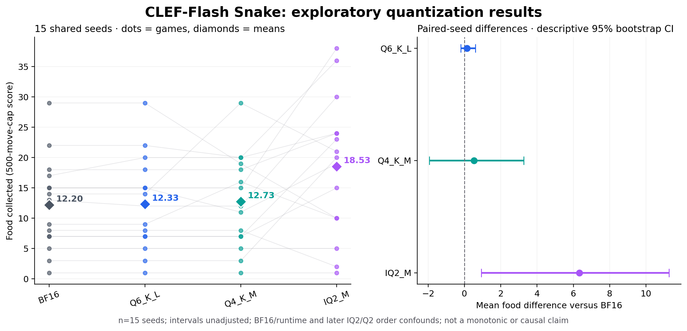

# Less Precision, Better Decisions?

*An exploratory study of CLEF-Flash backbone quantization on Snake.*

In **15 paired random environment seeds**, IQ2_M collected **18.53 food on average**, versus **12.20 for the official BF16 configuration**: an observed **+51.9%**, with **11 wins, 2 ties and 2 losses**. Q6_K_L and Q4_K_M stayed much closer to BF16. This is a task-specific observation, **not a monotonic relationship or proof that quantization improves reasoning**.



## Published snapshot

| Backbone configuration | Mean food | Median | Range | Collisions / capped alive |
|---|---:|---:|---|---|
| Official BF16 | 12.20 | 13 | 1–29 | 15 / 0 |
| Q6_K_L | 12.33 | 12 | 1–29 | 15 / 0 |
| Q4_K_M | 12.73 | 12 | 1–29 | 15 / 0 |
| IQ2_M | 18.53 | 20 | 1–38 | 14 / 1 |

**60 completed executions, 15 paired seed units. Q2_K's additional 15 rounds are running and are not included in this snapshot.** No incomplete Q2 result is presented as final. The complete extension will be added in a later commit.

The original deterministic demo was first run five times per configuration. Those were repeatability checks, not five distinct environments. The data published here use 15 distinct, saved random seeds, shared across variants.

## What is being measured?

- 12×12 Snake, fixed initial body `[[5,6],[4,6],[3,6],[2,6]]`, initially moving right.
- Structured state, not images: body, food, direction, factual collision checks, Manhattan distances and flood-fill open-space counts.
- Every action is the **unchanged official BF16 JointSchemaHead's argmax**. Unsafe choices are executed. No solver, action mask, fallback, sampling or recommended-action feature.
- Only food placement changes across rounds: SHA256-keyed per-event cell priorities; first unoccupied cell wins. The same seed/event gives the same priorities across models, **not necessarily the same later food coordinates** after bodies diverge.
- Collision ends a game. A 500-successful-move cap is an **alive, censored run**, not a loss. Terminal collisions count as attempted, not successful, moves.
- BF16/Q6/Q4 order rotates within seed. IQ2_M was added later and ran afterward, serially. Q2_K is another later extension.

GGUF recipe names do not mean every tensor has that bit width. The joint head is never quantized. Quantized `output.weight` rows are dequantized and cast to BF16 for lexical head inputs; official BF16 output embeddings are not silently substituted.

## Evidence and limitations

[Methods and reasoning](docs/METHODS.md) · [Research note](docs/PUBLICATION.md) · [Uncertainty methods](docs/UNCERTAINTY.md) · [Next experiments](docs/NEXT_EXPERIMENTS.md) · [Research TODO](TODO.md) · [Full data](data/2026-10-05)

The independent sample size is **15 paired seeds**, not thousands of correlated move calls. Models were added after observing results. The descriptive IQ2-minus-BF16 paired-bootstrap interval is approximately **+0.93 to +11.27 food**, unadjusted and exploratory. Do not headline statistical significance: the exploratory sign-flip comparison does not meet a 0.05 threshold after Holm adjustment across the initial quant-versus-BF16 comparisons.

**Runtime confounding:** official BF16 uses PyTorch/MPS; GGUF backbones use llama.cpp/Metal with raw, unpooled all-token final-normalized hidden states and the same official MPS head. A five-input BF16-GGUF bridge validation agreed on every action, with mean hidden-state cosine >0.9998, but arithmetic is not bit-identical. This is not a precision-only controlled study. Gameplay latency sees different states; it is descriptive, not a clean speed benchmark. Quant process RSS is a lifetime peak; BF16 RSS was not recorded.

Discovery hardware: Apple M4 Max, 128 GB unified memory, macOS, Python 3.12.13. Independent reproduction on another runtime/hardware can change numerical choices.

## Verify the published data — no weights, GPU or third-party packages needed

```sh
python3 -m unittest discover -s tests -v
python3 -m clef_snake.audit data/2026-10-05 --verify-hashes
```

The audit verifies **every full request including JSON field order and factual features**, head argmax/provenance, exact applied moves, food events, scores/caps, contiguous inference IDs and exact request/response matching to independently captured server logs. Full compressed JSONL logs are included, not selected examples. [Evidence format and integrity](docs/DATA.md).

## Reproduce model-backed games

See [complete setup and run instructions](docs/REPRODUCING.md). The tested inference implementation is macOS/Apple Silicon; the offline audit is portable. Dependencies/model/runtime revisions are pinned, weights are not included.

```sh
python3.12 -m venv .venv
. .venv/bin/activate
python -m pip install -r requirements-inference.txt
python -m clef_snake.download --root models --models bf16 q6-k-l q4-k-m iq2-m
python scripts/build_bridge.py
# Start the model servers as documented, then:
python -m clef_snake.benchmark --manifest data/2026-10-05/seed-manifest.json \
  --schedule data/2026-10-05/schedule.json --models bf16 q6-k-l q4-k-m iq2-m --out runs/replication
```

The new standalone driver is an independent Python implementation of the documented game/protocol, parity-checked against every recorded browser call. **The original browser UI is not redistributed** because its repository had no explicit license when checked. The immutable original evidence remains locally archived; original executed-source hashes are included in the public inventory. The public driver is not claimed to be the identical original executable.

## Agentic development and contributing

[AGENTS.md](AGENTS.md) maps the repo, verification commands and research-integrity boundaries. [CONTRIBUTING.md](CONTRIBUTING.md) explains independent replication and review. GitHub Actions runs only stdlib tests, Python compilation and every published dataset's full offline integrity/parity audit—no weights, secrets or GPU inference. Published evidence is preserved; new experiments get additive dataset directories.

## Credits and licensing

[Cloudflare CLEF-Flash](https://huggingface.co/Cloudflare/clef-flash), [Qwen3.5](https://huggingface.co/Qwen/Qwen3.5-9B), [bartowski GGUFs](https://huggingface.co/bartowski/Cloudflare_clef-flash-GGUF), [llama.cpp](https://github.com/ggml-org/llama.cpp), and the motivating [taeold/djev-run demo](https://github.com/taeold/djev-run). This project is an independent experiment, not an official evaluation or endorsement by those authors.

New project code, documentation and experimental data: Apache-2.0. The llama.cpp patch's upstream context remains MIT; included notice at [licenses/llama.cpp-MIT.txt](licenses/llama.cpp-MIT.txt). Model downloads remain governed by their upstream Apache-2.0 licenses. See [NOTICE](NOTICE). No checkpoints, credentials or personal workspace history are included.
