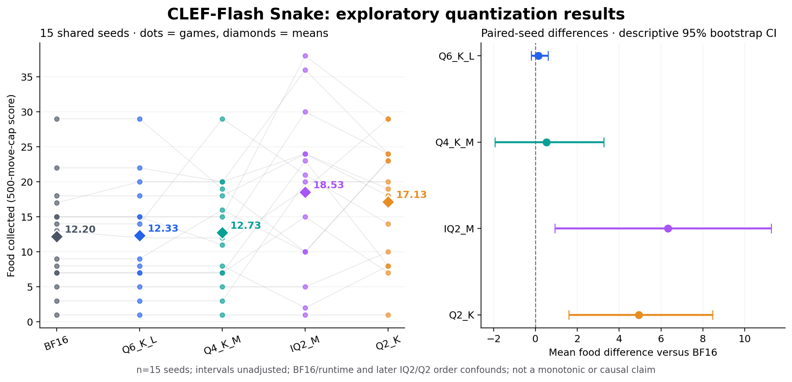

# Complete five-way discovery comparison

All **75 executions** are complete: BF16, Q6_K_L, Q4_K_M, IQ2_M and Q2_K, each evaluated on the same **15 saved seed units**. This extension does not create 15 new independent environments: it adds another model's outcomes on the original seeds.

| Backbone | Mean food | Median | Range | Wins / ties / losses vs BF16 | Collisions / capped alive |
|---|---:|---:|---|---|---|
| BF16 | 12.20 | 13 | 1–29 | — | 15 / 0 |
| Q6_K_L | 12.33 | 12 | 1–29 | 1 / 13 / 1 | 15 / 0 |
| Q4_K_M | 12.73 | 12 | 1–29 | 3 / 8 / 4 | 15 / 0 |
| IQ2_M | 18.53 | 20 | 1–38 | 11 / 2 / 2 | 14 / 1 |
| Q2_K | 17.13 | 19 | 1–29 | 10 / 4 / 1 | 15 / 0 |

Q2_K's observed mean difference versus BF16 is **+4.93 food (+40.4%)**. IQ2_M's is **+6.33 (+51.9%)**. Both lower-precision recipes outscored BF16 on these discovery seeds; their relative ranking does **not** establish a monotonic effect of bit width. They are mixed GGUF recipes, with an unchanged official BF16 decision head. IQ2_M is also slightly smaller in checkpoint size than Q2_K (3.54 versus 3.64 GB).



See the [five-way uncertainty analysis](UNCERTAINTY_FIVE_WAY.md), [machine-readable statistics](../data/2026-10-05-fiveway/uncertainty.json) and [SVG figure](../figures/2026-10-05-fiveway/quantization-snake-results.svg). Intervals are descriptive and unadjusted; the exploratory tests disclose the full four-variant comparison family.

## Evidence

The [five-way dataset](../data/2026-10-05-fiveway) includes all original full benchmark request/response logs and independent model-server logs, losslessly compressed. All **10,747 genuine decision calls** are audited for exact request/schema/feature/JSON-field-order parity with the independently implemented public driver; applied choices, food events, trajectories, scores/caps, model provenance and contiguous inference IDs; and exact server request/response matching.

```sh
python3 -m clef_snake.audit data/2026-10-05-fiveway --verify-hashes
```

The initial [60-execution dataset](../data/2026-10-05), initial figure, analysis and research note remain unchanged. The five-way directory is a distinct complete snapshot that deliberately includes earlier phases to allow a self-contained audit. Do not concatenate both directories as if they contained independent new observations.

## Analysis/presentation correction

The executed Q2 harness had an aggregate-dictionary label typo, `iq2-k` instead of the actual recorded model key `iq2-m`. This caused IQ2_M's row to be omitted from the live aggregate table, not from the underlying data. All 15 IQ2 episodes and requests were intact. The final analysis process normalizes that key to `iq2-m` and recomputes aggregates from all records. The running/archived game and server sources, saved seeds, policy, probabilities and outcomes were not altered. The correction is recorded in the final result's `analysis_repairs` field.

## Limits that still apply

- Discovery/model inclusion was adaptive and analyses are exploratory, not a held-out confirmation. Only 15 paired environment seeds establish skill uncertainty, not the number of calls.
- BF16 versus GGUF changes both precision and runtime. The quant variants share the same bridge/head, but recipe/output-row differences remain. The five-input BF16 bridge check is a compatibility check, not a full precision-only control.
- IQ2 and then Q2 ran after the counterbalanced primary three, with no overlapping GPU inference. Later execution order remains a confound.
- Same per-event priorities do not force identical later food coordinates when bodies differ. Full factual features are provided; this is not screenshot-based gameplay.
- One IQ2 game hit the 500-successful-move cap alive. Its observed score is included; no uncapped-score or survival conclusion follows.
- Gameplay latency compares different states. Quant RSS is process-lifetime peak, not round-local, and original BF16 RSS is unavailable.

See [METHODS.md](METHODS.md) for protocol reasoning and [NEXT_EXPERIMENTS.md](NEXT_EXPERIMENTS.md) for proposed held-out validation. No new confirmation rounds were run as part of packaging/publication.

## Additional visualization exports

[Cap-marked wide and portrait PNG/SVG figures](../analysis/2026-10-05-fiveway/FIGURES.md) reproduce the same paired statistics and explicitly identify the IQ2_M game capped alive at 36 food on seed 13. Source, generator and output hashes accompany these additive exports; the original published five-way figures and evidence remain unchanged. The [passive watcher](../watcher/README.md) also explores saved scores, paired outcomes, latency and final boards without inference.
